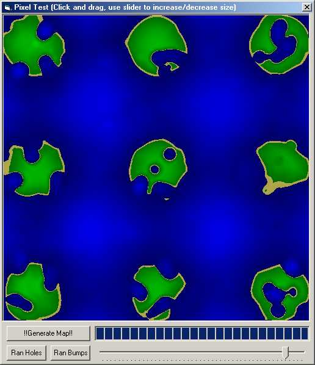



## Deformable Landscape

### Description

Using GetPixel and SetPixel a landscape is created, Once made the program allows you to make bumps, holes and you can use the mouse to make different size holes and bumps. Very entertaining
 
### More Info
 

             |
---                |---
**Submitted On**   |2002-08-04 16:41:50
**By**             |[Kevin Pfister](https://github.com/Planet-Source-Code/PSCIndex/blob/master/ByAuthor/kevin-pfister.md)
**Level**          |Intermediate
**User Rating**    |4.3 (26 globes from 6 users)
**Compatibility**  |VB 5\.0, VB 6\.0
**Category**       |[Graphics](https://github.com/Planet-Source-Code/PSCIndex/blob/master/ByCategory/graphics__1-46.md)
**World**          |[Visual Basic](https://github.com/Planet-Source-Code/PSCIndex/blob/master/ByWorld/visual-basic.md)
**Archive File**   |[Deformable114160842002\.zip](https://github.com/Planet-Source-Code/kevin-pfister-deformable-landscape__1-37618/archive/master.zip)

